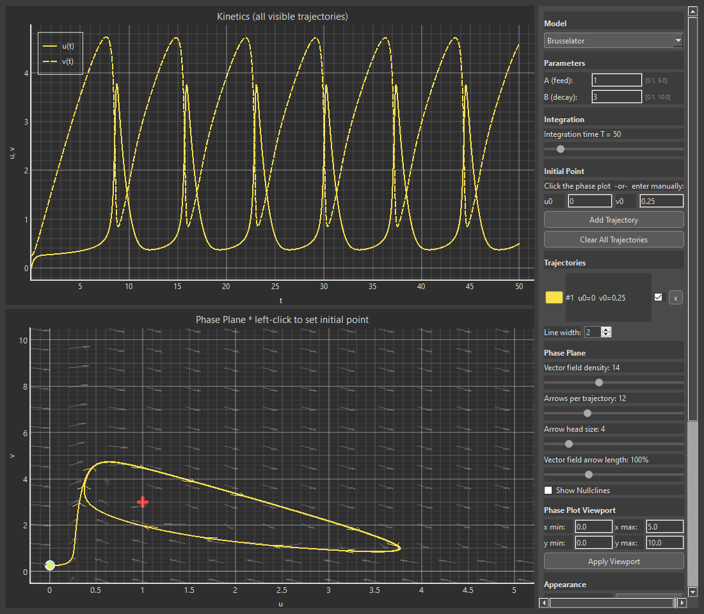

# Phase & Kinetic Plotter



An interactive tool for visualising two-variable autonomous dynamical systems

## Features

- **Phase plane**: trajectories with directional arrows, vector field, nullclines
  with tick marks, per-trajectory fixed-point markers, click-to-set initial point
- **Kinetic plot**: u(t) and v(t) for all visible trajectories, locked to data range
- **Stability analysis**: fixed points found numerically per trajectory,
  classified via Jacobian eigenvalues (node, focus, saddle, centre; stable/unstable)
- **Theming**: Dark / Grey / White themes, per-element colour pickers with opacity

## Requirements

```
python >= 3.11
PyQt6
pyqtgraph
numpy
scipy
sympy
```

Install with:

```bash
pip install -r requirements.txt
```

## Running

```bash
python main.py
```

## Adding a custom model

Drop a `.py` file in the `models/` directory. It will be auto-discovered at
startup. Required exports:

| Name                  | Type     | Description                                                                                    |
| --------------------- | -------- | ---------------------------------------------------------------------------------------------- |
| `META`                | `dict`   | `"name"` (str), `"initial_state"` ([u0, v0]), optionally `"viewport"` (xmin, xmax, ymin, ymax) |
| `PARAMS`              | `dict`   | Per-parameter dicts with `"default"`, `"min"`, `"max"`, `"label"`                              |
| `model(t, y, params)` | function | Returns `[du/dt, dv/dt]`                                                                       |

Optional (auto-generated if absent):

| Name                                 | Description                                                                                                                  |
| ------------------------------------ | ---------------------------------------------------------------------------------------------------------------------------- |
| `guesses(params)`                    | Starting points for fixed-point search                                                                                       |
| `isoclines(u_arr, params, **kwargs)` | Returns `((x1,y1), (x2,y2))` for the two nullclines; `kwargs` may include `v_range=(v_min, v_max)` from the current viewport |
| `domain_check(u0, v0)`               | Returns `(ok: bool, msg: str)` — if `ok` is `False` the user sees `msg` as a warning and integration is skipped              |

See `models/brusselator.py` (minimal) and `models/fitzhugh_nagumo.py`
(no `guesses`/`isoclines` - uses auto-generation) for examples.

## Color format

All colors are stored as `#RRGGBBAA` (8 hex digits, alpha last), consistent
with CSS/web convention. The alpha channel is exposed in the colour picker.
